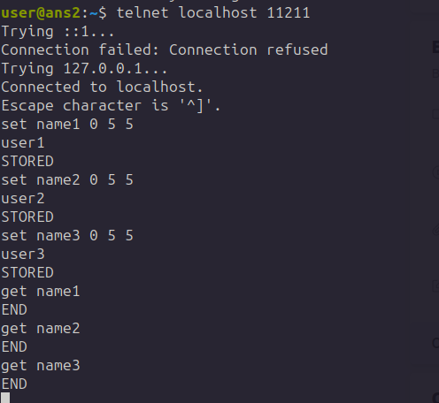

## «Система мониторинга Zabbix» Вознюк Ольга

### Задание 1

*Авторизация в админке*


*Использованные команды из `history`*

```
    5  wget https://repo.zabbix.com/zabbix/6.0/debian/pool/main/z/zabbix-release/zabbix-release_6.0-4%2Bdebian11_all.deb
    6  sudo dpkg -i zabbix-release_6.0-4+debian11_all.deb

    7  sudo apt update
    8  ls 
    9  sudo dpkg -i zabbix-release_6.0-4+debian11_all.deb 
   10  apt update 
   11  echo "deb http://ftp.de.debian.org/debian stretch main" >> /etc/apt/sources.list
   12  apt-get update && DEBIAN_FRONTEND=noninteractive apt-get install -y php7.0-pgsql
   13  nano /etc/apt/sources.list
   14  apt update 
   15  sudo apt-get update
   16  sudo apt -y install software-properties-common
   17  sudo add-apt-repository ppa:ondrej/php
   18  sudo apt-get update
   19  sudo apt -y install php7.4
   20  apt update 
   21  sudo apt -y install php7.4
   22  sudo add-apt-repository ppa:ondrej/php
   23  hp -v
   24  php -v
   25  sudo apt-get install -y php7.4-cli php7.4-json php7.4-common php7.4-mysql php7.4-zip php7.4-gd php7.4-mbstring php7.4-curl php7.4-xml php7.4-bcmath
   26  sudo add-apt-repository ppa:sergey-dryabzhinsky/php74
   27  sudo add-apt-repository ppa:sergey-dryabzhinsky/php7-modules
   28  sudo add-apt-repository ppa:sergey-dryabzhinsky/backports
   29  sudo add-apt-repository ppa:sergey-dryabzhinsky/packages
   30  apt upgrade 
   31  apt update 
   32  sudo apt install -y apt-transport-https lsb-release ca-certificates wget 
   33  wget -O /etc/apt/trusted.gpg.d/php.gpg https://packages.sury.org/php/apt.gpg
   34  echo "deb https://packages.sury.org/php/ $(lsb_release -sc) main" | sudo tee /etc/apt/sources.list.d/sury-php.list
   35  sudo wget -qO - https://packages.sury.org/php/apt.gpg | sudo gpg --no-default-keyring --keyring gnupg-ring:/etc/apt/trusted.gpg.d/debian-php-8.gpg --import
   36  sudo chmod 644 /etc/apt/trusted.gpg.d/debian-php-8.gpg
   37  apt update 
   38  rm /etc/apt/sources.list.d/sury-php.list 
   39  apt update 
   40  wget https://www.php.net/distributions/php-7.4.0.tar.gz
   41  ls 
   42  tar -xvzf php-7.4.0.tar.gz 
   43  ls 
   44  cd php-7.4.0/
   45  ./configure 
   46  make install
   47  apt install make 
   48  make install
   49  make install .
   50  make install .
   51  ./configure \
   52  ./configure
   53  make install
   54  apt install php libapache2-mod-php
   55  systemctl restart apache2
   56  systemctl status apache
   57  systemctl status apache2.service 
   58  php -v
   59  apt install php7.4-pgsql
   60  wget http://archive.ubuntu.com/ubuntu/pool/main/p/php7.4/php7.4-pgsql_7.4.3-4ubuntu2.23_amd64.deb
   61  ls 
   62  dpkg -i php7.4-pgsql_7.4.3-4ubuntu2.23_amd64.deb 
   63  wget http://archive.ubuntu.com/ubuntu/pool/main/p/php7.4/php7.4-common_7.4.3-4ubuntu1_amd64.deb
   64  dpkg -i php7.4-common_7.4.3-4ubuntu1_amd64.deb 
   65  apt-get install php7.4-common
   66  apt --fix-broken install
   67  apt-get install php7.4-common
   68  wget -O /etc/apt/trusted.gpg.d/php.gpg https://packages.sury.org/php/apt.gpg
   69   apt install zabbix-server-pgsql zabbix-frontend-php zabbix-apache-conf zabbix-sql-scripts nano -y # zabbix-agent
   70  apt install libldap-2.4-2
   71  apt install libldap-common 
   72  apt search libssl
   73  apt install libssl1.1
   74  apt install libssl
   75  apt-get install libssl-dev
   76   apt install zabbix-server-pgsql zabbix-frontend-php zabbix-apache-conf zabbix-sql-scripts nano -y # zabbix-agent
   77   libldap-common  --version
   78  apt-get install libldap2-dev=2.4.31-1+nmu2ubuntu8.2
   79  apt remove libldap-2.5-0 
   80  apt-get install libldap2-dev=2.4.31-1+nmu2ubuntu8.2
   81  apt-get install libldap2-dev checkinstall
   82   apt install zabbix-server-pgsql zabbix-frontend-php zabbix-apache-conf zabbix-sql-scripts nano -y # zabbix-agent
   83   apt install zabbix-server-pgsql zabbix-frontend-php zabbix-apache-conf zabbix-sql-scripts nano -y # zabbix-agent
   84  docker ps 
   85   apt install zabbix-server-pgsql zabbix-frontend-php zabbix-apache-conf zabbix-sql-scripts
   86   apt install zabbix-frontend-php zabbix-apache-conf zabbix-sql-scripts
   87   apt install zabbix-server-pgsql
   88  cat /etc/os-release 
   89  apt remove zabbix-release
   90  curl -LO https://repo.zabbix.com/zabbix/6.4/debian/pool/main/z/zabbix-release/zabbix-release_6.4-1%2Bdebian12_all.deb
   91  apt install curl
   92  curl -LO https://repo.zabbix.com/zabbix/6.4/debian/pool/main/z/zabbix-release/zabbix-release_6.4-1%2Bdebian12_all.deb
   93  dpkg -i zabbix-release_6.4-1%2Bdebian12_all.deb 
   94  apt update 
   95  apt install zabbix-server-pgsql zabbix-frontend-php zabbix-apache-conf zabbix-sql-scripts zabbix-agent2
   96  systemctl status zabbix-server.service 
   97  systemctl start zabbix-server.service 
   98  systemctl enable zabbix-server.service 
   99  systemctl status zabbix-server.service 
  100  sudo -u postgres createuser --pwprompt zabbix
  101  systemctl stop zabbix-server.service 
  102  systemctl status zabbix-server.service 
  103  su - postgres
  104  apt install postgresql-15
  105  sudo -u postgres createuser --pwprompt zabbix
```
 

 ### Задание 2

 *скриншот раздела Configuration > Hosts, где видно, что агенты подключены к серверу*

 

 *скриншот лога zabbix agent*

 

 *скриншот раздела Monitoring > Latest data*

 

 *Использованные команды из `history`*

```
wget https://repo.zabbix.com/zabbix/6.4/debian/pool/main/z/zabbix-release/zabbix-release_6.4-1+debian12_all.deb
--2024-07-28 12:49:54--  https://repo.zabbix.com/zabbix/6.4/debian/pool/main/z/zabbix-release/zabbix-release_6.4-1+debian12_all.deb
Resolving repo.zabbix.com (repo.zabbix.com)... 178.128.6.101
Connecting to repo.zabbix.com (repo.zabbix.com)|178.128.6.101|:443... connected.
HTTP request sent, awaiting response... 200 OK
Length: 3540 (3.5K) [application/octet-stream]
Saving to: ‘zabbix-release_6.4-1+debian12_all.deb’

zabbix-release_6.4-1+debian12_all.deb           100%[=====================================================================================================>]   3.46K  --.-KB/s    in 0s      

2024-07-28 12:49:55 (21.5 MB/s) - ‘zabbix-release_6.4-1+debian12_all.deb’ saved [3540/3540]

root@ans2:~# wget https://repo.zabbix.com/zabbix/6.4/debian/pool/main/z/zabbix-release/zabbix-release_6.4-1+debian12_all.deb^C
root@ans2:~# dpkg -i zabbix-release_6.4-1+debian12_all.deb
Selecting previously unselected package zabbix-release.
(Reading database ... 34374 files and directories currently installed.)
Preparing to unpack zabbix-release_6.4-1+debian12_all.deb ...
Unpacking zabbix-release (1:6.4-1+debian12) ...
Setting up zabbix-release (1:6.4-1+debian12) ...
root@ans2:~# apt update
Get:1 http://security.debian.org/debian-security bookworm-security InRelease [48.0 kB]
Get:2 http://deb.debian.org/debian bookworm InRelease [151 kB]                                       
Get:3 http://deb.debian.org/debian bookworm-updates InRelease [55.4 kB]            
Get:4 http://security.debian.org/debian-security bookworm-security/main Sources [105 kB]
Get:5 http://security.debian.org/debian-security bookworm-security/main amd64 Packages [169 kB]
Get:6 http://security.debian.org/debian-security bookworm-security/main Translation-en [102 kB]   
Get:7 http://deb.debian.org/debian bookworm/non-free-firmware Sources [6,456 B]                               
Get:8 http://deb.debian.org/debian bookworm/main Sources [9,485 kB]
Get:9 https://repo.zabbix.com/zabbix/6.4/debian bookworm InRelease [2,874 B]     
Get:10 https://repo.zabbix.com/zabbix/6.4/debian bookworm/main Sources [17.4 kB]
Get:11 http://deb.debian.org/debian bookworm/main amd64 Packages [8,788 kB]
Get:12 https://repo.zabbix.com/zabbix/6.4/debian bookworm/main amd64 Packages [46.8 kB]
Get:13 https://repo.zabbix.com/zabbix/6.4/debian bookworm/main all Packages [9,731 B]          
Get:14 http://deb.debian.org/debian bookworm/main Translation-en [6,109 kB]
Get:15 http://deb.debian.org/debian bookworm/non-free-firmware amd64 Packages [6,216 B]
Fetched 25.1 MB in 4s (6,195 kB/s)                      
Reading package lists... Done
Building dependency tree... Done
Reading state information... Done
42 packages can be upgraded. Run 'apt list --upgradable' to see them.
N: Repository 'http://deb.debian.org/debian bookworm InRelease' changed its 'Version' value from '12.5' to '12.6'
root@ans2:~# apt install zabbix-agent
Reading package lists... Done
Building dependency tree... Done
Reading state information... Done
The following additional packages will be installed:
  libcurl3-gnutls libcurl4 libmodbus5
The following NEW packages will be installed:
  libcurl4 libmodbus5 zabbix-agent
The following packages will be upgraded:
  libcurl3-gnutls
1 upgraded, 3 newly installed, 0 to remove and 41 not upgraded.
Need to get 1,496 kB of archives.
After this operation, 2,080 kB of additional disk space will be used.
Do you want to continue? [Y/n] y
Get:1 http://deb.debian.org/debian bookworm/main amd64 libcurl3-gnutls amd64 7.88.1-10+deb12u6 [385 kB]
Get:2 http://deb.debian.org/debian bookworm/main amd64 libcurl4 amd64 7.88.1-10+deb12u6 [390 kB]
Get:3 http://deb.debian.org/debian bookworm/main amd64 libmodbus5 amd64 3.1.6-2.1 [31.3 kB]
Get:4 https://repo.zabbix.com/zabbix/6.4/debian bookworm/main amd64 zabbix-agent amd64 1:6.4.17-1+debian12 [690 kB]
Fetched 1,496 kB in 4s (395 kB/s)      
Reading changelogs... Done
(Reading database ... 34380 files and directories currently installed.)
Preparing to unpack .../libcurl3-gnutls_7.88.1-10+deb12u6_amd64.deb ...
Unpacking libcurl3-gnutls:amd64 (7.88.1-10+deb12u6) over (7.88.1-10+deb12u5) ...
Selecting previously unselected package libcurl4:amd64.
Preparing to unpack .../libcurl4_7.88.1-10+deb12u6_amd64.deb ...
Unpacking libcurl4:amd64 (7.88.1-10+deb12u6) ...
Selecting previously unselected package libmodbus5:amd64.
Preparing to unpack .../libmodbus5_3.1.6-2.1_amd64.deb ...
Unpacking libmodbus5:amd64 (3.1.6-2.1) ...
Selecting previously unselected package zabbix-agent.
Preparing to unpack .../zabbix-agent_1%3a6.4.17-1+debian12_amd64.deb ...
Unpacking zabbix-agent (1:6.4.17-1+debian12) ...
Setting up libmodbus5:amd64 (3.1.6-2.1) ...
Setting up libcurl3-gnutls:amd64 (7.88.1-10+deb12u6) ...
Setting up libcurl4:amd64 (7.88.1-10+deb12u6) ...
Setting up zabbix-agent (1:6.4.17-1+debian12) ...
Created symlink /etc/systemd/system/multi-user.target.wants/zabbix-agent.service → /lib/systemd/system/zabbix-agent.service.
Processing triggers for man-db (2.11.2-2) ...
Processing triggers for libc-bin (2.36-9+deb12u7) ...
root@ans2:~# systemctl restart zabbix-agent
root@ans2:~# systemctl enable zabbix-agent
Synchronizing state of zabbix-agent.service with SysV service script with /lib/systemd/systemd-sysv-install.
Executing: /lib/systemd/systemd-sysv-install enable zabbix-agent
root@ans2:~# systemctl status zabbix-agent.service 
● zabbix-agent.service - Zabbix Agent
     Loaded: loaded (/lib/systemd/system/zabbix-agent.service; enabled; preset: enabled)
     Active: active (running) since Sun 2024-07-28 12:51:47 EDT; 47s ago
   Main PID: 1149 (zabbix_agentd)
      Tasks: 6 (limit: 2307)
     Memory: 4.3M
        CPU: 25ms
     CGroup: /system.slice/zabbix-agent.service
             ├─1149 /usr/sbin/zabbix_agentd -c /etc/zabbix/zabbix_agentd.conf
             ├─1150 "/usr/sbin/zabbix_agentd: collector [idle 1 sec]"
             ├─1151 "/usr/sbin/zabbix_agentd: listener #1 [waiting for connection]"
             ├─1152 "/usr/sbin/zabbix_agentd: listener #2 [waiting for connection]"
             ├─1153 "/usr/sbin/zabbix_agentd: listener #3 [waiting for connection]"
             └─1154 "/usr/sbin/zabbix_agentd: active checks #1 [idle 1 sec]"

Jul 28 12:51:47 ans2 systemd[1]: zabbix-agent.service: Deactivated successfully.
Jul 28 12:51:47 ans2 systemd[1]: Stopped zabbix-agent.service - Zabbix Agent.
Jul 28 12:51:47 ans2 systemd[1]: Starting zabbix-agent.service - Zabbix Agent...
Jul 28 12:51:47 ans2 systemd[1]: Started zabbix-agent.service - Zabbix Agent.
root@ans2:~# ss -tlpn | grep 10050
LISTEN 0      4096         0.0.0.0:10050      0.0.0.0:*    users:(("zabbix_agentd",pid=1154,fd=4),("zabbix_agentd",pid=1153,fd=4),("zabbix_agentd",pid=1152,fd=4),("zabbix_agentd",pid=1151,fd=4),("zabbix_agentd",pid=1150,fd=4),("zabbix_agentd",pid=1149,fd=4))
LISTEN 0      4096            [::]:10050         [::]:*    users:(("zabbix_agentd",pid=1154,fd=5),("zabbix_agentd",pid=1153,fd=5),("zabbix_agentd",pid=1152,fd=5),("zabbix_agentd",pid=1151,fd=5),("zabbix_agentd",pid=1150,fd=5),("zabbix_agentd",pid=1149,fd=5))

```


## «Система мониторинга Zabbix. часть 2» Вознюк Ольга
 ### Задание 1

 
 
 ### Задание 2-3

 

 ### Задание 4

 


## «Кластеризация и балансировка нагрузки»
 ### Задание 1

 * конфигурационный файл haproxy

 ```
 (my-venv) user@debian:~/my-venv/bin$ cat /etc/haproxy/haproxy.cfg
global
	log /dev/log local0
	user haproxy
	group haproxy
	daemon

defaults
	log global
	option httplog
	timeout connect 5000ms
	timeout client 50000ms
	timeout server 50000ms

frontend http_front
	bind *:8081
	default_backend http_back

backend http_back
	balance roundrobin
	server server1 127.0.0.1:9000 check
	server server2 127.0.0.1:9001 check
```  
* перенаправление запросов на разные серверы при обращении к HAProxy.


### Задание 2

* конфиг `haproxy.cfg`

```
user@debian:~$ cat /etc/haproxy/haproxy.cfg
global
	log /dev/log local0
	user haproxy
	group haproxy
	daemon

defaults
	log global
	option httplog
	timeout connect 5000ms
	timeout client 50000ms
	timeout server 50000ms

frontend example
	bind *:8081
	acl ACL_example_local hdr(host) -i example.local
	use_backend web_servers if ACL_example_local

backend web_servers
	mode http
	balance roundrobin
	option httpchk
	http-check send meth GET uri /index.html
	server server1 127.0.0.1:9000 weight 2
	server server2 127.0.0.1:9001 weight 3
	server server3 127.0.0.1:9002 weight 4   
```

* пример запросов с указанием `example.local`


* пример запросов без указания `example.local`


## Резервное копирование
### Задание1

* команда rsync и результат её выполнения


### Задание2
 * скрипт backup

```
user@ans2:~$ cat backup.sh 
#!/bin/bash

# Задаем переменные
SOURCE_DIR=~
BACKUP_DIR=/tmp/backup
LOG_FILE=/tmp/backup/backup.log
DATE=$(date '+%Y-%m-%d %H:%M:%S')

# Создаем директорию для резервных копий, если она не существует
mkdir -p $BACKUP_DIR

# Выполняем резервное копирование с rsync
if rsync -av --exclude='.*' --checksum $SOURCE_DIR/ $BACKUP_DIR/ >> $LOG_FILE 2>&1; then
    echo "$DATE: Backup successful" >> $LOG_FILE
else
    echo "$DATE: Backup failed" >> $LOG_FILE
fi
```
* файл crontab

```
user@ans2:~$ crontab -l
# Edit this file to introduce tasks to be run by cron.
# 
# Each task to run has to be defined through a single line
# indicating with different fields when the task will be run
# and what command to run for the task
# 
# To define the time you can provide concrete values for
# minute (m), hour (h), day of month (dom), month (mon),
# and day of week (dow) or use '*' in these fields (for 'any').
# 
# Notice that tasks will be started based on the cron's system
# daemon's notion of time and timezones.
# 
# Output of the crontab jobs (including errors) is sent through
# email to the user the crontab file belongs to (unless redirected).
# 
# For example, you can run a backup of all your user accounts
# at 5 a.m every week with:
# 0 5 * * 1 tar -zcf /var/backups/home.tgz /home/
# 
# For more information see the manual pages of crontab(5) and cron(8)
# 
# m h  dom mon dow   command
54 10 * * * /bin/bash ~/backup.sh
```
* результат работы утилиты


## Отказоустойчивость в облаке
### Задание 1

* Terraform playbook

```
# Объявление переменных для конфиденциальных параметров

variable "folder_id" {
  type = string
}

variable "vm_user" {
  type = string
}

variable "ssh_key" {
  type      = string
  sensitive = true
}

# Настройка провайдера

terraform {
  required_providers {
    yandex = {
      source = "yandex-cloud/yandex"
      version = ">= 0.47.0"
    }
  }
}

provider "yandex" {
  zone = "ru-central1-a"
  token     = "secret_token"
  folder_id = var.folder_id

}

# Создание сервисного аккаунта и назначение ему ролей

resource "yandex_iam_service_account" "for-autoscale" {
  name = "for-autoscale"
}

resource "yandex_resourcemanager_folder_iam_member" "vm-autoscale-sa-role-compute" {
  folder_id = var.folder_id
  role      = "editor"
  member    = "serviceAccount:${yandex_iam_service_account.for-autoscale.id}"
}

# Создание облачной сети и подсетей

resource "yandex_vpc_network" "network-1" {
  name = "network-1"
}

resource "yandex_vpc_subnet" "vm-autoscale-subnet-a" {
  name           = "vm-autoscale-subnet-a"
  zone           = "ru-central1-a"
  v4_cidr_blocks = ["192.168.1.0/24"]
  network_id     = yandex_vpc_network.network-1.id
}

resource "yandex_vpc_subnet" "vm-autoscale-subnet-b" {
  name           = "vm-autoscale-subnet-b"
  zone           = "ru-central1-b"
  v4_cidr_blocks = ["192.168.2.0/24"]
  network_id     = yandex_vpc_network.network-1.id
}

# Создание группы безопасности

resource "yandex_vpc_security_group" "sg-1" {
  name                = "sg-autoscale"
  network_id          = yandex_vpc_network.network-1.id
  egress {
    protocol          = "ANY"
    description       = "any"
    v4_cidr_blocks    = ["0.0.0.0/0"]
  }
  ingress {
    protocol          = "TCP"
    description       = "ext-http"
    v4_cidr_blocks    = ["0.0.0.0/0"]
    port              = 80
  }
  ingress {
    protocol          = "TCP"
    description       = "healthchecks"
    predefined_target = "loadbalancer_healthchecks"
    port              = 80
  }
}

# Указание готового образа ВМ

data "yandex_compute_image" "autoscale-image" {
  family = "container-optimized-image"
}

# Создание группы ВМ

resource "yandex_compute_instance_group" "autoscale-group" {
  name                = "autoscale-vm-ig"
  folder_id           = var.folder_id
  service_account_id  = yandex_iam_service_account.for-autoscale.id
  instance_template {

    platform_id = "standard-v3"
    resources {
      memory = 2
      cores  = 2
    }
  
    boot_disk {
      mode = "READ_WRITE"
      initialize_params {
        image_id = data.yandex_compute_image.autoscale-image.id
        size     = 30
      }
    }

    network_interface {
      network_id = yandex_vpc_network.network-1.id
      subnet_ids = [
        yandex_vpc_subnet.vm-autoscale-subnet-a.id,
        yandex_vpc_subnet.vm-autoscale-subnet-b.id
      ]
      
      nat                = true
    }

    metadata = {
      user-data = templatefile("config.tpl", {
        VM_USER = var.vm_user
        SSH_KEY = var.ssh_key
      })
      docker-container-declaration = file("declaration.yaml")
    }
  }

  scale_policy {
    auto_scale {
      initial_size           = 2
      measurement_duration   = 60
      cpu_utilization_target = 40
      min_zone_size          = 1
      max_size               = 6
      warmup_duration        = 120
    }
  }

  allocation_policy {
    zones = [
      "ru-central1-a",
      "ru-central1-b"
    ]
  }

  deploy_policy {
    max_unavailable = 1
    max_expansion   = 0
  }

  load_balancer {
    target_group_name        = "auto-group-tg"
    target_group_description = "load balancer target group"
  }
}

# Создание сетевого балансировщика

resource "yandex_lb_network_load_balancer" "balancer" {
  name = "group-balancer"

  listener {
    name        = "http"
    port        = 80
    target_port = 80
  }

  attached_target_group {
    target_group_id = yandex_compute_instance_group.autoscale-group.load_balancer[0].target_group_id
    healthcheck {
      name = "tcp"
      tcp_options {
        port = 80
      }
    }
  }
}
```

* Скриншот статуса балансировщика и целевой группы

 

 

* Скриншот страницы, которая открылась при запросе IP-адреса балансировщика


## Базы данных, их типы
### Задание 1 СУБД

> Кейс
> Крупная строительная компания, которая также занимается проектированием и девелопментом, решила создать правильную архитектуру для работы с данными. Ниже представлены задачи, которые необходимо решить для каждой предметной области.
>
> Какие типы СУБД, на ваш взгляд, лучше всего подойдут для решения этих задач и почему?
>
> 1.1. Бюджетирование проектов с дальнейшим формированием финансовых аналитических отчётов и прогнозирования рисков. СУБД должна гарантировать целостность и чёткую структуру данных.
>
> 1.1.* Хеширование стало занимать длительно время, какое API можно использовать для ускорения работы?
>
> 1.2. Под каждый девелоперский проект создаётся отдельный лендинг, и все данные по лидам стекаются в CRM к маркетологам и менеджерам по продажам. Какой тип СУБД лучше использовать для лендингов и для CRM? СУБД должны быть гибкими и быстрыми.
>
> 1.2.* Можно ли эту задачу закрыть одной СУБД? И если да, то какой именно СУБД и какой реализацией?
>
> 1.3. Отдел контроля качества решил создать базу по корпоративным нормам и правилам, обучающему материалу и так далее, сформированную согласно структуре компании. СУБД должна иметь простую и понятную структуру.
>
> 1.3.* Можно ли под эту задачу использовать уже существующую СУБД из задач выше и если да, то как лучше это реализовать?
>
> 1.4. Департамент логистики нуждается в решении задач по быстрому формированию маршрутов доставки материалов по объектам и распределению курьеров по маршрутам с доставкой документов. СУБД должна уметь быстро работать со связями.
>
> 1.4.* Можно ли к этой СУБД подключить отдел закупок или для них лучше сформировать свою СУБД в связке с СУБД логистов?
>
> 1.5.* Можно ли все перечисленные выше задачи решить, используя одну СУБД? Если да, то какую именно?
>
> Приведите ответ в свободной форме.
 

 > 1.1. Для бюджетирования проектов и формирования аналитических отчётов наилучшим вариантом будет использование реляционной СУБД, такой как PostgreSQL или MySQL. Эти СУБД обеспечивают строгую целостность данных благодаря поддержке транзакционности и механизмам проверки целостности. Они также прекрасно подходят для формирования комплексных отчетов с использованием SQL-запросов.

> 1.1.* Для ускорения процессов хеширования можно рассмотреть использование API, таких как OpenSSL или Bouncy Castle. Эти библиотеки предлагают быстрые и эффективные алгоритмы хеширования, которые могут значительно сократить время обработки.

> 1.2. Для лендингов и CRM целесообразно использовать NoSQL базы данных, такие как MongoDB или Firebase Firestore. Они обладают высокой гибкостью и быстро справляются с большими объемами неструктурированных данных, что идеально подходит для динамично меняющихся данных от пользователей.

> 1.2.* Да, эту задачу можно закрыть одной СУБД. Рекомендуется использовать MongoDB, которая прекрасно подойдёт как для хранения данных лендингов, так и для CRM. Она обеспечивает гибкость в хранении разнообразной информации и высокую скорость доступа.

> 1.3. Для создания базы по корпоративным нормам и обучающим материалам можно использовать ту же реляционную СУБД, что и для бюджетирования. Например, PostgreSQL может служить отличной основой для хранения как финансовых отчетов, так и структурированных данных по нормативам. Структуру таблиц можно адаптировать для хранения различных типов данных и связи между ними.

> 1.3.* Да, можно использовать уже существующую СУБД. Лучше всего это реализовать, добавив новые таблицы и отношения в той же базе данных, используемой для задач 1.1. Это позволит избежать избыточности данных и упростит администрирование.

> 1.4. Для задач логистики можно использовать графовые СУБД, такие как Neo4j, которые отлично работают со связями между объектами. Это подойдет для быстрого формирования маршрутов и управления курьерами. 

> 1.4.* Подразделение закупок можно подключить к графовой СУБД, что позволит им использовать данные о маршрутах и поставках. Если в закупках также нужны специфические данные, может потребоваться интеграция с реляционной СУБД.

> 1.5.* Да, все перечисленные задачи можно решить, используя одну СУБД, но это зависит от конкретных требований к данным. Рекомендуемая СУБД — PostgreSQL, так как она поддерживает как реляционные, так и некоторые NoSQL-принципы через расширения, что позволяет решать все поставленные задачи в рамках одной системы.
 
### Задание 2. Транзакции

> 2.1. Пользователь пополняет баланс счёта телефона, распишите пошагово, какие действия должны произойти для того, чтобы транзакция завершилась успешно. > Ориентируйтесь на шесть действий.

> 2.1.* Какие действия должны произойти, если пополнение счёта телефона происходило бы через автоплатёж?

**2.1. Пошаговые действия для успешного пополнения баланса счёта телефона:**

> 1. **Аутентификация пользователя:** Пользователь вводит свои учетные данные (логин и пароль) для доступа к системе. Проверяется, существует ли аккаунт и правильность введённых данных.

> 2. **Запрос на пополнение:** После успешной аутентификации пользователь выбирает опцию пополнения счёта и вводит необходимую сумму, которую он хочет внести на свой баланс.

> 3. **Проверка наличия средств:** Система проверяет, достаточно ли средств на банковском счёте или в другой платежной системе, выбранной пользователем для пополнения. Если средств недостаточно, транзакция отменяется.

> 4. **Создание транзакции:** Система генерирует уникальный идентификатор транзакции и сохраняет её состояние как ожидающее. Это необходимо для отслеживания и возможного восстановления транзакции в случае сбоя.

> 5. **Обработка платежа:** Система отправляет запрос на обработку платежа в соответствующий платежный шлюз или банк для списания средств. Платежный шлюз выполняет запрос и возвращает статус транзакции (успех или ошибка).

> 6. **Обновление баланса:** Если обработка платежа прошла успешно, система обновляет баланс пользователя, отражая новое значение. Пользователь получает уведомление о завершении транзакции и актуальном балансе.

> **2.1.* Действия при автоплатеже:**

> 1. **Аутентификация пользователя:** Как и в случае с ручным пополнением, система удостоверяется, что пользователь имеет активный аккаунт и учётные данные.

> 2. **Настройка автоплатежа:** Пользователь предварительно настраивает автоплатеж, выбирая сумму, периодичность (например, ежемесячно) и банковский счёт или платежную систему, с которой будут списываться средства.

> 3. **Запланированное выполнение:** Система отслеживает расписание автоплатежа. В назначенное время производится автоматическая генерация транзакции, без необходимости ручного вмешательства.

> 4. **Проверка наличия средств:** Перед списанием средств система проверяет наличие достаточной суммы на счёте пользователя.

> 5. **Обработка платежа:** Система отправляет запрос на автоматическую обработку платежа в платежный шлюз или банк. Получив ответ о статусе платежа, действующее состояние транзакции фиксируется.

> 6. **Обновление баланса:** После успешного списания средств со счёта, система автоматически обновляет баланс пользователя и отправляет уведомление о выполненном автоплатеже и новой сумме на счёте. 

> Такой подход позволяет пользователям удобно управлять своими расходами и поддерживать баланс, не задумываясь о периодических платежах.

### Задание 3. SQL vs NoSQL

> 3.1. Напишите пять преимуществ SQL-систем по отношению к NoSQL.
> 3.1.* Какие, на ваш взгляд, преимущества у NewSQL систем перед SQL и NoSQL.

> **3.1. Пять преимуществ SQL-систем по отношению к NoSQL:**

> 1. **Структурированные данные:** SQL-системы используют жесткую схему данных, что позволяет организовывать и хранить данные в структурированном виде. Это делает их идеальными для работы с предсказуемыми и однородными данными.

> 2. **Поддержка сложных запросов:** SQL-системы используют мощный язык запросов SQL, который позволяет выполнять сложные операции, такие как соединения (JOIN), агрегации и подзапросы, что позволяет получать полезную информацию из связанных таблиц.

> 3. **Транзакционная целостность (ACID):** SQL-системы гарантируют соблюдение свойств ACID (атомарность, согласованность, изолированность и долговечность), что обеспечивает надежность транзакций и предотвращает потерю данных в случае сбоя.

> 4. **Широкая поддержка и зрелость:** SQL-системы существуют на рынке с 1970-х годов, и многие из них имеют обширную базу пользователей и документации, что облегчает обучение и решение проблем. Существуют также стандартные инструменты для администрирования баз данных.

> 5. **Сложные аналитические операции:** SQL-системы предлагают мощные средства для аналитики и отчетности, что позволяет бизнесу эффективно анализировать данные для принятия информированных решений.

> **3.1.* Преимущества NewSQL систем перед SQL и NoSQL:**

> 1. **Сочетание преимуществ SQL и масштабируемости NoSQL:** NewSQL системы предлагают преимущества традиционных SQL баз данных, такие как поддержка ACID-транзакций, и при этом обеспечивают возможность горизонтального масштабирования, подобно системам NoSQL, что позволяет обрабатывать большие объемы данных и запросов.

> 2. **Высокая производительность:** NewSQL разработки, как правило, используют оптимизации, такие как распределенные системы и параллельная обработка, что позволяет им достигать высокой производительности при больших нагрузках, что делает их конкурентоспособными в современных условиях.

> 3. **Гибкое управление схемой:** Многие NewSQL системы предлагают более гибкие схемы данных, чем традиционные SQL, и позволяют разработчикам адаптироваться к изменениям в структурах данных без разрушения существующих приложений.

> 4. **Поддержка облачных технологий:** NewSQL системы часто созданы с учетом облачной архитектуры, что позволяет легко применять облачные решения и использовать преимущества облачной инфраструктуры, такие как автоматическое резервное копирование и восстановление.

> 5. **Интеграция с современными технологиями:** NewSQL базы данных обеспечивают совместимость с современными технологиями аналитики, машинного обучения и больших данных, позволяя компаниям эффективно использовать данные в своих бизнес-решениях и иновациях.

> В результате, NewSQL представляет собой интересную альтернативу, привнося лучшие черты как из мира SQL, так и из NoSQL, адаптируясь под современные требования к данным и масштабируемости.

### Задание 4. Кластеры


> Необходимо производить большое количество вычислений при работе с огромным количеством данных, под эту задачу выделено 1000 машин.
> На основе какого критерия будете выбирать тип СУБД и какая модель распределённых вычислений здесь справится лучше всего и почему?

> При выборе типа системы управления базами данных (СУБД) для обработки огромного количества данных на 1000 машинах, важно учитывать несколько ключевых критериев:

> 1. Объем данных и природа запросов: Необходимо оценить, с каким объемом данных будет работать система и какие типы запросов будут исполняться. Если данные структурированы и требуют сложной аналитики, возможно, стоит рассмотреть SQL СУБД. Однако, если необходимо работать с неструктурированными или полуструктурированными данными, логично выбрать NoSQL решения.

> 2. Масштабируемость: С учетом большого количества машин, важно, чтобы СУБД могла легко масштабироваться как вертикально, так и горизонтально. Поэтому стоит обратить внимание на системы, которые поддерживают распределенное хранение данных и автоматическое масштабирование.

> 3. Производительность и отзывчивость: Ускорение обработки запросов — один из основных критериев. Важно учитывать, как система справляется с большими объемами параллельных запросов, и насколько эффективно реализованы механизмы кэширования и индексации.

> 4. Поддержка распределенных вычислений: Система должна обеспечивать эффективную обработку данных на уровне кластеров. Поддержка распределенных транзакций и обработка данных в реальном времени являются ключевыми для эффективной работы на таком большом количестве машин.

> 5. Соответствие требованиям ACID: Если требуется высокая целостность данных и надежность транзакций, это может стать важным фактором в выборе традиционных SQL СУБД, тогда как для менее критичных задач можно рассмотреть NoSQL решения.

> Модель распределенных вычислений:

> На основе вышеуказанных критериев, для обработки больших данных в таком распределенном окружении на 1000 машинах наиболее эффективно подойдут:

> 1. Apache Hadoop: Эта модель обработки данных позволяет эффективно распределять и обрабатывать данные на большом количестве узлов. Она идеально подходит для обработки больших объемов данных и выполнения сложных расчетов. Hadoop использует модель MapReduce, что делает ее высокоэффективной для обработки параллельных вычислений.

> 2. Apache Spark: Это еще одно мощное решение для обработки данных в распределенном окружении. Spark предлагает более высокую производительность по сравнению с Hadoop, поскольку он работает в памяти и использует более простой API. Это отлично подходит для интерактивной обработки данных и в реальном времени.

> 3. Dask: Эта библиотека предоставляет динамические данные и параллельные вычисления непосредственно в Python-коде, что может быть удобно для тех, кто работает с научной и аналитической обработкой данных.

> Подводя итог, выбор типа СУБД и модель распределенных вычислений должны быть основаны на природe данных, требованиях к производительности и надежности, требованиях к масштабируемости и способности системы к обработке параллельных запросов. Это позволит наиболее эффективно использовать 1000 машин для обработки больших объемов данных.


## Кеширование Redis/memcached
### Задание 1. Кеширование


> Приведите примеры проблем, которые может решить кеширование.

> Кеширование — это мощная техника, которая позволяет значительно улучшить производительность и эффективность систем, сокращая время доступа к данным и снижая нагрузку на основные источники данных. Рассмотрим несколько примеров проблем, которые кеширование может решить.

> 1. Повышение скорости доступа к данным
Когда пользователи обращаются к часто запрашиваемой информации, кеширование позволяет возвращать эти данные гораздо быстрее, чем если бы каждый раз приходилось обращаться к основному хранилищу данных. Например, в веб-приложении, где пользователи регулярно запрашивают одни и те же страницы, кеширование результатов запросов (например, HTML-кода) значительно ускоряет время загрузки страниц.

> 2. Снижение нагрузки на базу данных
При большом количестве пользователей, одновременно обращающихся к базе данных для получения одинаковых данных, может возникать значительная нагрузка, что может привести к замедлению ответов или даже сбоям. Кеширование позволяет снизить количество обращений к базе, так как данные могут храниться во временном хранилище и предоставляться оттуда, что разгружает основной источник данных.

> 3. Увеличение пропускной способности
Кеширование может увеличить общее количество запросов, которые система может обработать одновременно. Например, если данные или результаты вычислений кешируются в памяти, выполнение одного и того же запроса для разных пользователей требует минимального времени на выполнение, что может значительно повысить общую пропускную способность приложения.

> 4. Улучшение пользовательского опыта
Благодаря кешированию пользователи могут получать данные и услуги быстрее. Время отклика приложения — критически важный фактор для удовлетворенности пользователей. Быстрее загружающиеся страницы или приложения ведут к улучшению общего опыта и, как следствие, увеличению вероятности возвращения пользователей.

> 5. Оптимизация сетевого трафика
В распределенных систем, особенно в облачных и микросервисных архитектурах, кеширование может сократить объем сетевого трафика. Например, с помощью CDN (Content Delivery Network) можно кешировать статические ресурсы (изображения, видео, скрипты) ближе к пользователям, что уменьшает задержки и скорость загрузки.

> 6. Уменьшение затрат на обработку больших данных
При работе с большими данными, кеширование результатов промежуточных вычислений может значительно ускорить анализ и обработку, так как не придется повторно выполнять одни и те же громоздкие запросы.

> 7. Снижение времени простоя
Кеширование может играть важную роль в ситуациях, когда основное хранилище данных временно недоступно. Например, если база данных временно выходит из строя, кешированные данные могут продолжать предоставляться пользователям, минимизируя время простоя и снижая влияние на бизнес-процессы.

> Кеширование — это эффективный способ улучшения производительности и надежности систем. Однако важно правильно управлять кешем, чтобы избежать проблем с устаревшими данными и обеспечить их актуальность.


### Задание 2. Memcached

> Установите и запустите memcached.

* Cкриншот systemctl status memcached


### Задание 3. Удаление по TTL в Memcached

> Запишите в memcached несколько ключей с любыми именами и значениями, для которых выставлен TTL 5.




### Задание 4. Запись данных в Redis

> Запишите в Redis несколько ключей с любыми именами и значениями.


## ELK

### Задание 1. Elasticsearch

> Установите и запустите Elasticsearch, после чего поменяйте параметр cluster_name на случайный.

> Приведите скриншот команды 'curl -X GET 'localhost:9200/_cluster/health?pretty', сделанной на сервере с установленным Elasticsearch. Где будет виден нестандартный cluster_name.

 

### Задание 2. Kibana

> Установите и запустите Kibana.

> Приведите скриншот интерфейса Kibana на странице http://<ip вашего сервера>:5601/app/dev_tools#/console, где будет выполнен запрос GET /_cluster/health?pretty.


### Задание 3. Logstash

> Установите и запустите Logstash и Nginx. С помощью Logstash отправьте access-лог Nginx в Elasticsearch.

> Приведите скриншот интерфейса Kibana, на котором видны логи Nginx.


### Задание 4. Filebeat

> Установите и запустите Filebeat. Переключите поставку логов Nginx с Logstash на Filebeat.


## Базы данных
### Задание 1. 

> Опишите не менее семи таблиц, из которых состоит база данных:

> какие данные хранятся в этих таблицах;
> какой тип данных у столбцов в этих таблицах, если данные хранятся в PostgreSQL.
> Приведите решение к следующему виду:

> Сотрудники (

> идентификатор, первичный ключ, serial,
> фамилия varchar(50),
> ...
> идентификатор структурного подразделения, внешний ключ, integer).

1. Сотрудники
```
Сотрудники (
    идентификатор serial PRIMARY KEY,
    ФИО varchar(255),
    оклад decimal(10, 2),
    должность varchar(100),
    идентификатор_подразделения integer,
    идентификатор_подотдела integer,
    дата_найма date,
    идентификатор_проекта integer,
    адрес varchar(255)
).
```
2. Подразделения
```
Подразделения (
    идентификатор serial PRIMARY KEY,
    название varchar(100),
    описание text
).
```
3. Подотделы
```
Подотделы (
    идентификатор serial PRIMARY KEY,
    название varchar(100),
    описание text,
    идентификатор_подразделения integer REFERENCES Подразделения(идентификатор)
).
```
4. Проекты
```
Проекты (
    идентификатор serial PRIMARY KEY,
    название varchar(100),
    описание text,
    дата_начала date,
    дата_завершения date
).
```
5. Участие_в_проектах
```
Участие_в_проектах (
    идентификатор serial PRIMARY KEY,
    идентификатор_сотрудника integer REFERENCES Сотрудники(идентификатор),
    идентификатор_проекта integer REFERENCES Проекты(идентификатор)
).
```
6. Зарплаты
```
Зарплаты (
    идентификатор serial PRIMARY KEY,
    идентификатор_сотрудника integer REFERENCES Сотрудники(идентификатор),
    сумма decimal(10, 2),
    дата_выплаты date
).
```
7. Адреса
```
Адреса (
    идентификатор serial PRIMARY KEY,
    адрес varchar(255),
    город varchar(100),
    страна varchar(100)
).
```


 ## Домашнее задание Работа с данными (DDL/DML)
 ### Задание 1.

 1.1. Поднимите чистый инстанс MySQL версии 8.0+. Можно использовать локальный сервер или контейнер Docker.

1.2. Создайте учётную запись sys_temp.

1.3. Выполните запрос на получение списка пользователей в базе данных. (скриншот)

1.4. Дайте все права для пользователя sys_temp.

1.5. Выполните запрос на получение списка прав для пользователя sys_temp. (скриншот)

1.6. Переподключитесь к базе данных от имени sys_temp.

Для смены типа аутентификации с sha2 используйте запрос:

ALTER USER 'sys_test'@'localhost' IDENTIFIED WITH mysql_native_password BY 'password';
1.6. По ссылке https://downloads.mysql.com/docs/sakila-db.zip скачайте дамп базы данных.

1.7. Восстановите дамп в базу данных.

1.8. При работе в IDE сформируйте ER-диаграмму получившейся базы данных. При работе в командной строке используйте команду для получения всех таблиц базы данных. (скриншот)

Результатом работы должны быть скриншоты обозначенных заданий, а также простыня со всеми запросами.


> Запросы: 

CREATE USER 'sys_temp'@'%' IDENTIFIED BY 'password';
SELECT user, host FROM mysql.user;
GRANT ALL PRIVILEGES ON *.* TO 'sys_temp'@'%';
FLUSH PRIVILEGES;
SHOW GRANTS FOR 'sys_temp'@'%';
docker exec -it mysql8 mysql -usys_temp -ppassword
SHOW TABLES FROM sakila;
SELECT TABLE_NAME 
FROM INFORMATION_SCHEMA.TABLES 
WHERE TABLE_SCHEMA = 'sakila';

### Задание 2.

> Составьте таблицу, используя любой текстовый редактор или Excel, в которой должно быть два столбца: в первом должны быть названия таблиц восстановленной базы, во втором названия первичных ключей этих таблиц. Пример: (скриншот/текст)

```
Название таблицы | Название первичного ключа
customer         | customer_id
actor            | actor_id
address          | address_id
category         | category_id
city             | city_id
country          | country_id
customer         | customer_id
film             | film_id
film_actor       | actor_id
film_category    | film_id
film_text        | film_id
inventory        | inventory_id
language         | language_id
payment          | payment_id
rental           | rental_id
staff            | staff_id
store            | store_id
```


## Домашнее задание к занятию «SQL. Часть 1»

### Задание 1.

> Получите уникальные названия районов из таблицы с адресами, которые начинаются на “K” и заканчиваются на “a” и не содержат пробелов.

```
SELECT DISTINCT district FROM address WHERE district LIKE 'K%a' AND district NOT LIKE '% %';
+-----------+
| district  |
+-----------+
| Kanagawa  |
| Kalmykia  |
| Kaduna    |
| Karnataka |
| K�tahya   |
| Kerala    |
| Kitaa     |
+-----------+
```
### Задание 2.

> Получите из таблицы платежей за прокат фильмов информацию по платежам, которые выполнялись
> в промежуток с 15 июня 2005 года по 18 июня 2005 года включительно и стоимость которых превышает 10.00.

```
SELECT * FROM payment WHERE payment_date >= '2005-06-15 00:00:00' AND payment_date < '2005-06-19 00:00:00' AND amount > 10.00;
+------------+-------------+----------+-----------+--------+---------------------+---------------------+
| payment_id | customer_id | staff_id | rental_id | amount | payment_date        | last_update         |
+------------+-------------+----------+-----------+--------+---------------------+---------------------+
|        908 |          33 |        1 |      1301 |  10.99 | 2005-06-15 09:46:33 | 2006-02-15 22:12:36 |
|       7017 |         260 |        1 |      2091 |  10.99 | 2005-06-17 18:09:04 | 2006-02-15 22:14:58 |
|       8272 |         305 |        1 |      2166 |  11.99 | 2005-06-17 23:51:21 | 2006-02-15 22:15:47 |
|      12888 |         477 |        1 |      2306 |  10.99 | 2005-06-18 08:33:23 | 2006-02-15 22:19:46 |
|      13892 |         516 |        1 |      1718 |  10.99 | 2005-06-16 14:52:02 | 2006-02-15 22:20:47 |
|      14620 |         544 |        2 |      1434 |  10.99 | 2005-06-15 18:30:46 | 2006-02-15 22:21:35 |
|      15313 |         572 |        2 |      1889 |  10.99 | 2005-06-17 04:05:12 | 2006-02-15 22:22:22 |
+------------+-------------+----------+-----------+--------+---------------------+---------------------+
```

### Задание 3.

> Получите последние пять аренд фильмов.

```
SELECT * FROM rental  ORDER BY rental_date DESC LIMIT 5;
+-----------+---------------------+--------------+-------------+-------------+----------+---------------------+
| rental_id | rental_date         | inventory_id | customer_id | return_date | staff_id | last_update         |
+-----------+---------------------+--------------+-------------+-------------+----------+---------------------+
|     11739 | 2006-02-14 15:16:03 |         4568 |         373 | NULL        |        2 | 2006-02-15 21:30:53 |
|     14616 | 2006-02-14 15:16:03 |         4537 |         532 | NULL        |        1 | 2006-02-15 21:30:53 |
|     11676 | 2006-02-14 15:16:03 |         4496 |         216 | NULL        |        2 | 2006-02-15 21:30:53 |
|     15966 | 2006-02-14 15:16:03 |         4472 |         374 | NULL        |        1 | 2006-02-15 21:30:53 |
|     13486 | 2006-02-14 15:16:03 |         4460 |         274 | NULL        |        1 | 2006-02-15 21:30:53 |
+-----------+---------------------+--------------+-------------+-------------+----------+---------------------+
```
### Задание 4.
> Одним запросом получите активных покупателей, имена которых Kelly или Willie.
> Сформируйте вывод в результат таким образом:
> все буквы в фамилии и имени из верхнего регистра переведите в нижний регистр,
> замените буквы 'll' в именах на 'pp'.

```
SELECT LOWER(REPLACE(first_name, 'LL', 'pp')) AS first_name, LOWER(last_name) AS last_name FROM customer WHERE active = 1 AND (first_name = 'Kelly' OR first_name = 'Willie');
+------------+-----------+
| first_name | last_name |
+------------+-----------+
| keppy      | torres    |
| wippie     | howell    |
| wippie     | markham   |
| keppy      | knott     |
+------------+-----------+
```


## Домашнее задание к занятию «SQL. Часть 2»
### Задание 1.

> Одним запросом получите информацию о магазине, в котором обслуживается более 300 покупателей, и выведите в результат следующую информацию:
> фамилия и имя сотрудника из этого магазина;
> город нахождения магазина;
> количество пользователей, закреплённых в этом магазине.

```
SELECT s.first_name AS staff_first_name, s.last_name AS staff_last_name, c.city AS store_city, COUNT(cu.customer_id) AS customer_count FROM store st JOIN staff s ON st.store_id = s.store_id JOIN address a ON st.address_id = a.address_id JOIN city c ON a.city_id = c.city_id JOIN customer cu ON st.store_id = cu.store_id GROUP BY st.store_id, s.first_name, s.last_name, c.city HAVING COUNT(cu.customer_id) > 300;
+------------------+-----------------+------------+----------------+
| staff_first_name | staff_last_name | store_city | customer_count |
+------------------+-----------------+------------+----------------+
| Mike             | Hillyer         | Lethbridge |            326 |
+------------------+-----------------+------------+----------------+
```

### Задание 2.

> Получите количество фильмов, продолжительность которых больше средней продолжительности всех фильмов.

```
SELECT COUNT(*) AS film_count FROM film WHERE length > (SELECT AVG(length) FROM film);
+------------+
| film_count |
+------------+
|        489 |
+------------+
```
### Задание 3.

> Получите информацию, за какой месяц была получена наибольшая сумма платежей, и добавьте информацию по количеству аренд за этот месяц.

```
SELECT DATE_FORMAT(p.payment_date, '%Y-%m') AS payment_month, SUM(p.amount) AS total_payments, COUNT(r.rental_id) AS rental_count FROM payment p JOIN rental r ON p.rental_id = r.rental_id GROUP BY payment_month ORDER BY total_payments DESC LIMIT 1;
+---------------+----------------+--------------+
| payment_month | total_payments | rental_count |
+---------------+----------------+--------------+
| 2005-07       |       28368.91 |         6709 |
+---------------+----------------+--------------+
```

### Домашнее задание к занятию «Индексы»
## Задание 1.
> Напишите запрос к учебной базе данных, который вернёт процентное отношение общего размера всех индексов к общему размеру всех таблиц.

```
SELECT ROUND( (SUM(INDEX_LENGTH) / SUM(DATA_LENGTH)) * 100,  2 ) AS index_to_data_ratio_percentage FROM information_schema.TABLES WHERE TABLE_SCHEMA = 'sakila';
+--------------------------------+
| index_to_data_ratio_percentage |
+--------------------------------+
|                          54.68 |
+--------------------------------+
```

### Задание 2.
Выполните explain analyze следующего запроса:
```
select distinct concat(c.last_name, ' ', c.first_name), sum(p.amount) over (partition by c.customer_id, f.title)
from payment p, rental r, customer c, inventory i, film f
where date(p.payment_date) = '2005-07-30' and p.payment_date = r.rental_date and r.customer_id = c.customer_id and i.inventory_id = r.inventory_id
```
перечислите узкие места;
оптимизируйте запрос: внесите корректировки по использованию операторов, при необходимости добавьте индексы.

```
Database changed
mysql> select distinct concat(c.last_name, ' ', c.first_name), sum(p.amount) over (partition by c.customer_id, f.title) from payment p, rental r, customer c, inventory i, film f where date(p.payment_date) = '2005-07-30' and p.payment_date = r.rental_date and r.customer_id = c.customer_id and i.inventory_id = r.inventory_id;
+----------------------------------------+----------------------------------------------------------+
| concat(c.last_name, ' ', c.first_name) | sum(p.amount) over (partition by c.customer_id, f.title) |
+----------------------------------------+----------------------------------------------------------+
| JOHNSON PATRICIA                       |                                                    30.95 |
| WILLIAMS LINDA                         |                                                     5.98 |
| JONES BARBARA                          |                                                    11.98 |
| BROWN ELIZABETH                        |                                                     6.98 |
| MOORE MARGARET                         |                                                     4.99 |
| ANDERSON LISA                          |                                                    16.98 |
| THOMAS NANCY                           |                                                    11.97 |
| JACKSON KAREN                          |                                                    10.98 |
| WHITE BETTY                            |                                                     4.99 |
| HARRIS HELEN                           |                                                     4.99 |
| MARTIN SANDRA                          |                                                     0.99 |
| THOMPSON DONNA                         |                                                    24.95 |
| GARCIA CAROL                           |                                                     9.98 |
| MARTINEZ RUTH                          |                                                     6.98 |
| ROBINSON SHARON                        |                                                     8.98 |
| CLARK MICHELLE                         |                                                     0.99 |
| RODRIGUEZ LAURA                        |                                                     0.99 |
| LEWIS SARAH                            |                                                    15.98 |
| LEE KIMBERLY                           |                                                     4.99 |
| WALKER DEBORAH                         |                                                    12.97 |
| HALL JESSICA                           |                                                     0.99 |
| ALLEN SHIRLEY                          |                                                     0.99 |
| YOUNG CYNTHIA                          |                                                     2.99 |
| HERNANDEZ ANGELA                       |                                                     4.99 |
| KING MELISSA                           |                                                     2.99 |
| WRIGHT BRENDA                          |                                                     0.99 |
| LOPEZ AMY                              |                                                     2.99 |
| HILL ANNA                              |                                                    11.97 |
| SCOTT REBECCA                          |                                                     3.99 |
| GREEN VIRGINIA                         |                                                     8.98 |
| ADAMS KATHLEEN                         |                                                     7.98 |
| GONZALEZ MARTHA                        |                                                    10.96 |
| NELSON DEBRA                           |                                                     1.99 |
| CARTER AMANDA                          |                                                     8.99 |
| MITCHELL STEPHANIE                     |                                                     5.99 |
| PEREZ CAROLYN                          |                                                     3.99 |
| ROBERTS CHRISTINE                      |                                                     4.99 |
| CAMPBELL CATHERINE                     |                                                     8.99 |
| PARKER FRANCES                         |                                                     4.99 |
| EVANS ANN                              |                                                     7.99 |
| EDWARDS JOYCE                          |                                                     0.99 |
| COLLINS DIANE                          |                                                     0.99 |
| STEWART ALICE                          |                                                     0.99 |
| SANCHEZ JULIE                          |                                                     4.99 |
| MORRIS HEATHER                         |                                                     4.99 |
| ROGERS TERESA                          |                                                     4.99 |
| REED DORIS                             |                                                     2.99 |
| MORGAN EVELYN                          |                                                     3.97 |
| MURPHY CHERYL                          |                                                     8.99 |
| BAILEY MILDRED                         |                                                     4.99 |
| RICHARDSON ASHLEY                      |                                                     0.99 |
| HOWARD ROSE                            |                                                     3.99 |
| WARD JANICE                            |                                                     5.99 |
| PETERSON NICOLE                        |                                                     3.99 |
| GRAY JUDY                              |                                                     2.99 |
| JAMES KATHY                            |                                                     0.99 |
| WATSON THERESA                         |                                                     8.98 |
| BROOKS BEVERLY                         |                                                     2.99 |
| KELLY DENISE                           |                                                     4.99 |
| SANDERS TAMMY                          |                                                    15.97 |
| PRICE IRENE                            |                                                     3.98 |
| BENNETT JANE                           |                                                     4.99 |
| WOOD LORI                              |                                                    10.98 |
| ROSS MARILYN                           |                                                     6.99 |
| HENDERSON ANDREA                       |                                                     3.99 |
| COLEMAN KATHRYN                        |                                                    19.97 |
| PERRY SARA                             |                                                     2.99 |
| POWELL ANNE                            |                                                     7.99 |
| LONG JACQUELINE                        |                                                     4.99 |
| PATTERSON WANDA                        |                                                    12.97 |
| FLORES JULIA                           |                                                     3.98 |
| WASHINGTON RUBY                        |                                                    12.98 |
| BUTLER LOIS                            |                                                     8.97 |
| SIMMONS TINA                           |                                                     9.98 |
| BRYANT PAULA                           |                                                     6.99 |
| ALEXANDER DIANA                        |                                                     8.98 |
| HAYES ROBIN                            |                                                    10.98 |
| FORD CRYSTAL                           |                                                     7.97 |
| HAMILTON GLADYS                        |                                                     4.99 |
| GRAHAM RITA                            |                                                     3.99 |
| SULLIVAN DAWN                          |                                                    22.96 |
| WALLACE CONNIE                         |                                                     2.99 |
| WOODS FLORENCE                         |                                                     5.98 |
| WEST EDNA                              |                                                     0.99 |
| REYNOLDS ROSA                          |                                                    11.98 |
| FISHER CINDY                           |                                                     6.99 |
| GIBSON VICTORIA                        |                                                     6.99 |
| CRUZ KIM                               |                                                     4.99 |
| MARSHALL SHERRY                        |                                                     2.99 |
| ORTIZ SYLVIA                           |                                                     6.99 |
| GOMEZ JOSEPHINE                        |                                                    12.97 |
| WEBB ETHEL                             |                                                    14.98 |
| SIMPSON ELLEN                          |                                                     6.99 |
| TUCKER MARJORIE                        |                                                    14.97 |
| HUNTER CHARLOTTE                       |                                                     0.99 |
| HICKS MONICA                           |                                                     3.99 |
| HENRY PAULINE                          |                                                     6.97 |
| MASON JUANITA                          |                                                    14.98 |
| MORALES ANITA                          |                                                     0.99 |
| KENNEDY RHONDA                         |                                                    20.96 |
| WARREN HAZEL                           |                                                     1.99 |
| DIXON AMBER                            |                                                     2.99 |
| RAMOS EVA                              |                                                     5.98 |
| REYES DEBBIE                           |                                                     7.99 |
| BURNS APRIL                            |                                                    16.97 |
| SHAW CLARA                             |                                                    17.96 |
| HOLMES LUCILLE                         |                                                     2.99 |
| ROBERTSON JOANNE                       |                                                     2.99 |
| HUNT ELEANOR                           |                                                     8.98 |
| DANIELS DANIELLE                       |                                                     2.99 |
| PALMER MEGAN                           |                                                     4.99 |
| MILLS ALICIA                           |                                                     5.99 |
| GRANT MICHELE                          |                                                     2.99 |
| FERGUSON BERTHA                        |                                                     6.99 |
| ROSE DARLENE                           |                                                     7.98 |
| STONE VERONICA                         |                                                     4.98 |
| HAWKINS JILL                           |                                                     4.98 |
| PERKINS GERALDINE                      |                                                     5.98 |
| HUDSON LAUREN                          |                                                     4.99 |
| STEPHENS LORRAINE                      |                                                     7.99 |
| PAYNE LYNN                             |                                                     8.99 |
| BERRY REGINA                           |                                                    11.97 |
| MATTHEWS ERICA                         |                                                     0.99 |
| WAGNER DOLORES                         |                                                    10.98 |
| WILLIS BERNICE                         |                                                    15.97 |
| RAY AUDREY                             |                                                     4.99 |
| WATKINS YVONNE                         |                                                     4.99 |
| CARROLL JUNE                           |                                                     6.99 |
| DUNCAN SAMANTHA                        |                                                     1.99 |
| SNYDER MARION                          |                                                    12.98 |
| HART DANA                              |                                                     4.99 |
| CUNNINGHAM STACY                       |                                                     0.99 |
| BRADLEY ANA                            |                                                    19.97 |
| RUIZ VIVIAN                            |                                                     5.98 |
| HARPER ROBERTA                         |                                                     3.98 |
| FOX HOLLY                              |                                                     9.97 |
| RILEY BRITTANY                         |                                                     2.99 |
| CARPENTER LORETTA                      |                                                     6.98 |
| GREENE JEANETTE                        |                                                     4.99 |
| LAWRENCE LAURIE                        |                                                     7.99 |
| ELLIOTT KATIE                          |                                                     2.99 |
| CHAVEZ KRISTEN                         |                                                     7.99 |
| SIMS VANESSA                           |                                                     6.99 |
| AUSTIN ALMA                            |                                                     5.99 |
| PETERS SUE                             |                                                     5.98 |
| KELLEY ELSIE                           |                                                     0.99 |
| FIELDS VICKI                           |                                                     0.99 |
| GUTIERREZ CARLA                        |                                                    12.97 |
| RYAN TARA                              |                                                    10.99 |
| SCHMIDT ROSEMARY                       |                                                     6.98 |
| CARR EILEEN                            |                                                     4.99 |
| VASQUEZ TERRI                          |                                                     2.99 |
| WHEELER LUCY                           |                                                     3.99 |
| CHAPMAN TONYA                          |                                                     6.99 |
| MONTGOMERY STACEY                      |                                                    10.98 |
| RICHARDS WILMA                         |                                                     3.99 |
| WILLIAMSON GINA                        |                                                    14.97 |
| BANKS JESSIE                           |                                                     2.99 |
| MEYER NATALIE                          |                                                     0.99 |
| BISHOP AGNES                           |                                                     3.98 |
| MCCOY VERA                             |                                                     6.99 |
| ALVAREZ CHARLENE                       |                                                    18.98 |
| MORRISON BESSIE                        |                                                    14.98 |
| GARZA PEARL                            |                                                     0.99 |
| BURTON COLLEEN                         |                                                     2.99 |
| JACOBS GEORGIA                         |                                                     5.99 |
| REID CONSTANCE                         |                                                    14.97 |
| LYNCH JACKIE                           |                                                     5.99 |
| DEAN MARCIA                            |                                                     5.99 |
| GILBERT TANYA                          |                                                     5.99 |
| GARRETT NELLIE                         |                                                     4.99 |
| WELCH MARLENE                          |                                                     5.99 |
| LARSON HEIDI                           |                                                     6.99 |
| FRAZIER GLENDA                         |                                                     3.99 |
| BURKE LYDIA                            |                                                     2.99 |
| DAY COURTNEY                           |                                                     5.98 |
| FOWLER JO                              |                                                     0.99 |
| BREWER VICKIE                          |                                                     3.98 |
| HOFFMAN MATTIE                         |                                                     0.99 |
| SILVA MAXINE                           |                                                     1.99 |
| PEARSON IRMA                           |                                                     6.99 |
| HOLLAND MABEL                          |                                                     2.99 |
| DOUGLAS MARSHA                         |                                                     6.99 |
| FLEMING MYRTLE                         |                                                     4.99 |
| JENSEN LENA                            |                                                    21.97 |
| VARGAS CHRISTY                         |                                                     5.98 |
| DAVIDSON PATSY                         |                                                     6.99 |
| MAY GWENDOLYN                          |                                                     2.99 |
| TERRY JENNIE                           |                                                     2.99 |
| HERRERA NORA                           |                                                     5.99 |
| WADE MARGIE                            |                                                    15.97 |
| SOTO NINA                              |                                                    10.98 |
| LOWE PRISCILLA                         |                                                    11.97 |
| JENNINGS NAOMI                         |                                                     4.99 |
| BARNETT CAROLE                         |                                                     2.99 |
| GRAVES BRANDY                          |                                                    16.96 |
| HORTON BILLIE                          |                                                     7.98 |
| BARRETT TRACEY                         |                                                     1.98 |
| CASTRO JENNY                           |                                                     1.99 |
| SUTTON FELICIA                         |                                                     7.98 |
| GREGORY SONIA                          |                                                     2.99 |
| LUCAS VELMA                            |                                                     6.99 |
| MILES BECKY                            |                                                     6.99 |
| CRAIG BOBBIE                           |                                                     2.99 |
| RODRIQUEZ VIOLET                       |                                                     2.99 |
| CHAMBERS KRISTINA                      |                                                     8.98 |
| HOLT TONI                              |                                                    11.98 |
| LAMBERT MISTY                          |                                                     8.99 |
| FLETCHER MAE                           |                                                     2.99 |
| WATTS SHELLY                           |                                                     2.99 |
| BATES DAISY                            |                                                    10.98 |
| HALE RAMONA                            |                                                     8.98 |
| RHODES SHERRI                          |                                                     2.99 |
| FARNSWORTH JOHN                        |                                                     3.98 |
| BAUGHMAN ROBERT                        |                                                     4.99 |
| SILVERMAN MICHAEL                      |                                                    19.97 |
| MCCRARY RICHARD                        |                                                     4.99 |
| KOWALSKI CHARLES                       |                                                     9.98 |
| GRIGSBY THOMAS                         |                                                     3.98 |
| GRECO CHRISTOPHER                      |                                                     2.99 |
| CABRAL DANIEL                          |                                                     7.99 |
| RINEHART MARK                          |                                                    10.98 |
| MAHON DONALD                           |                                                     3.99 |
| LINTON GEORGE                          |                                                    10.98 |
| BAUGH EDWARD                           |                                                     2.99 |
| WEINER RONALD                          |                                                     5.98 |
| MORRISSEY JASON                        |                                                    14.97 |
| MAHAN MATTHEW                          |                                                     2.99 |
| WAGGONER FRANK                         |                                                     7.96 |
| ROBERT ERIC                            |                                                    10.98 |
| QUALLS STEPHEN                         |                                                     7.98 |
| PURDY ANDREW                           |                                                    15.98 |
| MCWHORTER RAYMOND                      |                                                     7.99 |
| MAULDIN GREGORY                        |                                                    11.97 |
| MARK JOSHUA                            |                                                     9.98 |
| JORDON JERRY                           |                                                    14.98 |
| GILMAN DENNIS                          |                                                     7.99 |
| PERRYMAN WALTER                        |                                                     6.98 |
| MARTINO HAROLD                         |                                                     2.99 |
| GRAF DOUGLAS                           |                                                     5.99 |
| ARTIS CARL                             |                                                     7.98 |
| SALISBURY RYAN                         |                                                     4.99 |
| QUINTANILLA ROGER                      |                                                     2.99 |
| GILLILAND JOE                          |                                                     1.99 |
| CROUSE ALBERT                          |                                                     0.99 |
| NGO JUSTIN                             |                                                     3.98 |
| FULTZ GERALD                           |                                                    10.98 |
| RICO KEITH                             |                                                     3.99 |
| MARLOW SAMUEL                          |                                                     0.99 |
| MADRIGAL RALPH                         |                                                     6.97 |
| VARNEY BENJAMIN                        |                                                     4.99 |
| SCHWARZ BRUCE                          |                                                     7.98 |
| HUEY BRANDON                           |                                                     9.98 |
| GOOCH ADAM                             |                                                     8.98 |
| ARCE HARRY                             |                                                     5.99 |
| WHEAT FRED                             |                                                     5.98 |
| POULIN BILLY                           |                                                    13.98 |
| MACKENZIE STEVE                        |                                                     5.99 |
| LEONE LOUIS                            |                                                    14.97 |
| HURTADO JEREMY                         |                                                     0.99 |
| SELBY AARON                            |                                                     2.99 |
| FORTNER HOWARD                         |                                                     8.98 |
| BRINSON RUSSELL                        |                                                     7.98 |
| BOUDREAU BOBBY                         |                                                     5.98 |
| BARKLEY VICTOR                         |                                                    21.97 |
| MORRELL CRAIG                          |                                                     3.98 |
| KAHN ALAN                              |                                                     4.99 |
| HEATON SHAWN                           |                                                     8.98 |
| GAMEZ CLARENCE                         |                                                     8.97 |
| BROTHERS CHRIS                         |                                                     0.99 |
| SHANKS EARL                            |                                                     5.99 |
| SCHRADER JIMMY                         |                                                     0.99 |
| MEEK ANTONIO                           |                                                     8.98 |
| HARDISON BRYAN                         |                                                     5.99 |
| WAY MIKE                               |                                                    10.98 |
| SCROGGINS STANLEY                      |                                                     9.98 |
| SCHOFIELD LEONARD                      |                                                     5.99 |
| RUNYON NATHAN                          |                                                    18.94 |
| MURRELL MANUEL                         |                                                     8.97 |
| MOELLER RODNEY                         |                                                     0.99 |
| IRBY CURTIS                            |                                                     3.98 |
| PINSON JEFFERY                         |                                                     2.99 |
| ESTEP TRAVIS                           |                                                     5.98 |
| EAST JEFF                              |                                                    10.99 |
| LANCE JACOB                            |                                                     0.99 |
| HAWKS LEE                              |                                                     4.99 |
| CASILLAS ALFRED                        |                                                     2.99 |
| SPURLOCK KYLE                          |                                                    14.96 |
| SIKES FRANCIS                          |                                                     1.98 |
| MOTLEY BRADLEY                         |                                                    10.98 |
| HOULE RAY                              |                                                     2.99 |
| BONE DON                               |                                                     8.98 |
| TOMLIN EDDIE                           |                                                     4.99 |
| SHELBY RICKY                           |                                                     5.98 |
| QUIGLEY TROY                           |                                                     9.99 |
| NEUMANN RANDALL                        |                                                     5.98 |
| LOVELACE BARRY                         |                                                     3.99 |
| FENNELL ALEXANDER                      |                                                     7.98 |
| COLBY BERNARD                          |                                                     7.98 |
| BUSTAMANTE LEROY                       |                                                     4.99 |
| FORMAN MICHEAL                         |                                                     0.99 |
| CULP THEODORE                          |                                                    14.97 |
| BOWENS CLIFFORD                        |                                                    17.97 |
| BETANCOURT MIGUEL                      |                                                    10.99 |
| MILNER TOM                             |                                                     8.98 |
| MARTEL CALVIN                          |                                                    13.98 |
| GRESHAM ALEX                           |                                                    10.98 |
| COLLAZO TOMMY                          |                                                     9.98 |
| BLAKELY DEREK                          |                                                     4.99 |
| POWER DARRELL                          |                                                     7.99 |
| EBERT LEO                              |                                                     6.98 |
| BULL WESLEY                            |                                                     2.99 |
| ALLARD GORDON                          |                                                    12.98 |
| SAUER DEAN                             |                                                     2.99 |
| ROBINS GREG                            |                                                     5.99 |
| OLIVARES JORGE                         |                                                    13.98 |
| GILLETTE DUSTIN                        |                                                     2.99 |
| CHESTNUT PEDRO                         |                                                     7.99 |
| BOURQUE DERRICK                        |                                                     6.99 |
| PAINE DAN                              |                                                     8.99 |
| HITE ZACHARY                           |                                                    14.98 |
| HAUSER COREY                           |                                                    11.98 |
| DEVORE HERMAN                          |                                                     4.99 |
| VU ROBERTO                             |                                                    15.98 |
| TOBIAS CLYDE                           |                                                    17.96 |
| TALBERT GLEN                           |                                                     0.99 |
| POINDEXTER HECTOR                      |                                                    14.97 |
| MILLARD SHANE                          |                                                     5.99 |
| MEADOR RICARDO                         |                                                     5.98 |
| MCDUFFIE SAM                           |                                                     4.99 |
| CHOATE RAMON                           |                                                    12.97 |
| BESS CHARLIE                           |                                                     9.99 |
| SLEDGE GILBERT                         |                                                    14.98 |
| SANBORN GENE                           |                                                     0.99 |
| KINDER REGINALD                        |                                                     4.98 |
| GEARY RUBEN                            |                                                     2.99 |
| CORNWELL BRETT                         |                                                     0.99 |
| RHOADS EDGAR                           |                                                     5.98 |
| EASTER BEN                             |                                                     4.99 |
| BENNER CHESTER                         |                                                     7.98 |
| VINES CECIL                            |                                                     7.98 |
| TROUTMAN FRANKLIN                      |                                                     3.99 |
| NOE ELMER                              |                                                     4.99 |
| DELUCA RON                             |                                                    11.98 |
| HAVENS ARNOLD                          |                                                    29.95 |
| GUAJARDO HARVEY                        |                                                     2.99 |
| CLARY ADRIAN                           |                                                     4.99 |
| HERZOG CLAUDE                          |                                                     8.99 |
| GUILLEN ERIK                           |                                                    11.97 |
| WAUGH JAMIE                            |                                                     5.98 |
| JUNG CHRISTIAN                         |                                                    10.98 |
| ELROD JAVIER                           |                                                     0.99 |
| CHURCHILL FERNANDO                     |                                                    11.98 |
| BREAUX TED                             |                                                     0.99 |
| BOLIN MATHEW                           |                                                     0.99 |
| NOLEN CODY                             |                                                    15.98 |
| KNOTT KELLY                            |                                                     4.99 |
| CHRISTENSON NELSON                     |                                                     7.99 |
| BROWNLEE GUY                           |                                                     8.99 |
| BARBEE CLAYTON                         |                                                     3.98 |
| WALDROP HUGH                           |                                                    13.98 |
| PITT MAX                               |                                                     4.99 |
| LOMBARDI DWIGHT                        |                                                     5.99 |
| GRUBER ARMANDO                         |                                                     5.99 |
| GAFFNEY FELIX                          |                                                    12.96 |
| EGGLESTON JIMMIE                       |                                                     2.99 |
| BANDA EVERETT                          |                                                     0.99 |
| ARCHULETA JORDAN                       |                                                     5.98 |
| PFEIFFER BOB                           |                                                     4.98 |
| MENA CASEY                             |                                                     9.98 |
| MCADAMS ALFREDO                        |                                                    14.98 |
| GARDINER DAVE                          |                                                     9.97 |
| CROMWELL IVAN                          |                                                    11.97 |
| CHISHOLM JOHNNIE                       |                                                     6.98 |
| BURLESON SIDNEY                        |                                                     3.99 |
| OGLESBY ISAAC                          |                                                     5.98 |
| MCCARTER MORRIS                        |                                                    10.98 |
| LARUE DARYL                            |                                                    14.96 |
| GREY ROSS                              |                                                    10.97 |
| WOFFORD VIRGIL                         |                                                     4.98 |
| TEEL SALVADOR                          |                                                     8.98 |
| SWAFFORD PERRY                         |                                                     8.99 |
| OCAMPO MARION                          |                                                     7.98 |
| HERRMANN TRACY                         |                                                     4.99 |
| HANNON SETH                            |                                                     0.99 |
| ROUSH TERRANCE                         |                                                     8.98 |
| MCALISTER RENE                         |                                                    13.98 |
| GUNDERSON TERRENCE                     |                                                    11.96 |
| DUGGAN FREDDIE                         |                                                     4.99 |
| DELVALLE WADE                          |                                                     4.99 |
| CINTRON AUSTIN                         |                                                     6.99 |
+----------------------------------------+----------------------------------------------------------+
391 rows in set (4.37 sec)
```

> после исправления запроса
```
 SELECT c.last_name, c.first_name, SUM(p.amount) AS total_amount FROM payment p JOIN rental r ON p.payment_date = r.rental_date JOIN customer c ON r.customer_id = c.customer_id JOIN inventory i ON r.inventory_id = i.inventory_id JOIN film f ON i.film_id = f.film_id WHERE p.payment_date >= '2005-07-30' AND p.payment_date < DATE_ADD('2005-07-30', INTERVAL 1 DAY) GROUP BY c.last_name, c.first_name;
+-------------+-------------+--------------+
| last_name   | first_name  | total_amount |
+-------------+-------------+--------------+
| JOHNSON     | PATRICIA    |        30.95 |
| WILLIAMS    | LINDA       |         5.98 |
| JONES       | BARBARA     |        11.98 |
| BROWN       | ELIZABETH   |         6.98 |
| MOORE       | MARGARET    |         4.99 |
| ANDERSON    | LISA        |        16.98 |
| THOMAS      | NANCY       |        11.97 |
| JACKSON     | KAREN       |        10.98 |
| WHITE       | BETTY       |         4.99 |
| HARRIS      | HELEN       |         4.99 |
| MARTIN      | SANDRA      |         0.99 |
| THOMPSON    | DONNA       |        24.95 |
| HENRY       | PAULINE     |         6.97 |
| GARCIA      | CAROL       |         9.98 |
| MARTINEZ    | RUTH        |         6.98 |
| ROBINSON    | SHARON      |         8.98 |
| CLARK       | MICHELLE    |         0.99 |
| RODRIGUEZ   | LAURA       |         0.99 |
| LEWIS       | SARAH       |        15.98 |
| LEE         | KIMBERLY    |         4.99 |
| WALKER      | DEBORAH     |        12.97 |
| HALL        | JESSICA     |         0.99 |
| ALLEN       | SHIRLEY     |         0.99 |
| YOUNG       | CYNTHIA     |         2.99 |
| HERNANDEZ   | ANGELA      |         4.99 |
| KING        | MELISSA     |         2.99 |
| WRIGHT      | BRENDA      |         0.99 |
| LOPEZ       | AMY         |         2.99 |
| HILL        | ANNA        |        11.97 |
| SCOTT       | REBECCA     |         3.99 |
| GREEN       | VIRGINIA    |         8.98 |
| ADAMS       | KATHLEEN    |         7.98 |
| GONZALEZ    | MARTHA      |        10.96 |
| MADRIGAL    | RALPH       |         6.97 |
| NELSON      | DEBRA       |         1.99 |
| CARTER      | AMANDA      |         8.99 |
| MITCHELL    | STEPHANIE   |         5.99 |
| PEREZ       | CAROLYN     |         3.99 |
| ROBERTS     | CHRISTINE   |         4.99 |
| CAMPBELL    | CATHERINE   |         8.99 |
| PARKER      | FRANCES     |         4.99 |
| EVANS       | ANN         |         7.99 |
| EDWARDS     | JOYCE       |         0.99 |
| COLLINS     | DIANE       |         0.99 |
| STEWART     | ALICE       |         0.99 |
| SANCHEZ     | JULIE       |         4.99 |
| MORRIS      | HEATHER     |         4.99 |
| ROGERS      | TERESA      |         4.99 |
| REED        | DORIS       |         2.99 |
| MORGAN      | EVELYN      |         3.97 |
| MURPHY      | CHERYL      |         8.99 |
| BAILEY      | MILDRED     |         4.99 |
| RICHARDSON  | ASHLEY      |         0.99 |
| HOWARD      | ROSE        |         3.99 |
| WARD        | JANICE      |         5.99 |
| PETERSON    | NICOLE      |         3.99 |
| GRAY        | JUDY        |         2.99 |
| JAMES       | KATHY       |         0.99 |
| WATSON      | THERESA     |         8.98 |
| BROOKS      | BEVERLY     |         2.99 |
| KELLY       | DENISE      |         4.99 |
| SANDERS     | TAMMY       |        15.97 |
| PRICE       | IRENE       |         3.98 |
| BENNETT     | JANE        |         4.99 |
| WOOD        | LORI        |        10.98 |
| ROSS        | MARILYN     |         6.99 |
| HENDERSON   | ANDREA      |         3.99 |
| COLEMAN     | KATHRYN     |        19.97 |
| PERRY       | SARA        |         2.99 |
| POWELL      | ANNE        |         7.99 |
| LONG        | JACQUELINE  |         4.99 |
| PATTERSON   | WANDA       |        12.97 |
| FLORES      | JULIA       |         3.98 |
| WASHINGTON  | RUBY        |        12.98 |
| BUTLER      | LOIS        |         8.97 |
| SIMMONS     | TINA        |         9.98 |
| BRYANT      | PAULA       |         6.99 |
| ALEXANDER   | DIANA       |         8.98 |
| HAYES       | ROBIN       |        10.98 |
| FORD        | CRYSTAL     |         7.97 |
| HAMILTON    | GLADYS      |         4.99 |
| GRAHAM      | RITA        |         3.99 |
| SULLIVAN    | DAWN        |        22.96 |
| WALLACE     | CONNIE      |         2.99 |
| WOODS       | FLORENCE    |         5.98 |
| WEST        | EDNA        |         0.99 |
| REYNOLDS    | ROSA        |        11.98 |
| FISHER      | CINDY       |         6.99 |
| GIBSON      | VICTORIA    |         6.99 |
| CRUZ        | KIM         |         4.99 |
| MARSHALL    | SHERRY      |         2.99 |
| ORTIZ       | SYLVIA      |         6.99 |
| GOMEZ       | JOSEPHINE   |        12.97 |
| LARUE       | DARYL       |        14.96 |
| WEBB        | ETHEL       |        14.98 |
| SIMPSON     | ELLEN       |         6.99 |
| TUCKER      | MARJORIE    |        14.97 |
| HUNTER      | CHARLOTTE   |         0.99 |
| HICKS       | MONICA      |         3.99 |
| MASON       | JUANITA     |        14.98 |
| MORALES     | ANITA       |         0.99 |
| KENNEDY     | RHONDA      |        20.96 |
| WARREN      | HAZEL       |         1.99 |
| DIXON       | AMBER       |         2.99 |
| RAMOS       | EVA         |         5.98 |
| REYES       | DEBBIE      |         7.99 |
| BURNS       | APRIL       |        16.97 |
| SHAW        | CLARA       |        17.96 |
| HOLMES      | LUCILLE     |         2.99 |
| ROBERTSON   | JOANNE      |         2.99 |
| HUNT        | ELEANOR     |         8.98 |
| DANIELS     | DANIELLE    |         2.99 |
| PALMER      | MEGAN       |         4.99 |
| MILLS       | ALICIA      |         5.99 |
| GRANT       | MICHELE     |         2.99 |
| FERGUSON    | BERTHA      |         6.99 |
| ROSE        | DARLENE     |         7.98 |
| STONE       | VERONICA    |         4.98 |
| HAWKINS     | JILL        |         4.98 |
| PERKINS     | GERALDINE   |         5.98 |
| HUDSON      | LAUREN      |         4.99 |
| STEPHENS    | LORRAINE    |         7.99 |
| PAYNE       | LYNN        |         8.99 |
| BERRY       | REGINA      |        11.97 |
| MATTHEWS    | ERICA       |         0.99 |
| WAGNER      | DOLORES     |        10.98 |
| WILLIS      | BERNICE     |        15.97 |
| RAY         | AUDREY      |         4.99 |
| WATKINS     | YVONNE      |         4.99 |
| CARROLL     | JUNE        |         6.99 |
| DUNCAN      | SAMANTHA    |         1.99 |
| SNYDER      | MARION      |        12.98 |
| HART        | DANA        |         4.99 |
| CUNNINGHAM  | STACY       |         0.99 |
| BRADLEY     | ANA         |        19.97 |
| RUIZ        | VIVIAN      |         5.98 |
| HARPER      | ROBERTA     |         3.98 |
| FOX         | HOLLY       |         9.97 |
| RILEY       | BRITTANY    |         2.99 |
| CARPENTER   | LORETTA     |         6.98 |
| GREENE      | JEANETTE    |         4.99 |
| LAWRENCE    | LAURIE      |         7.99 |
| ELLIOTT     | KATIE       |         2.99 |
| CHAVEZ      | KRISTEN     |         7.99 |
| SIMS        | VANESSA     |         6.99 |
| AUSTIN      | ALMA        |         5.99 |
| PETERS      | SUE         |         5.98 |
| KELLEY      | ELSIE       |         0.99 |
| FIELDS      | VICKI       |         0.99 |
| GUTIERREZ   | CARLA       |        12.97 |
| RYAN        | TARA        |        10.99 |
| SCHMIDT     | ROSEMARY    |         6.98 |
| CARR        | EILEEN      |         4.99 |
| VASQUEZ     | TERRI       |         2.99 |
| WHEELER     | LUCY        |         3.99 |
| CHAPMAN     | TONYA       |         6.99 |
| MONTGOMERY  | STACEY      |        10.98 |
| RICHARDS    | WILMA       |         3.99 |
| WILLIAMSON  | GINA        |        14.97 |
| BANKS       | JESSIE      |         2.99 |
| MEYER       | NATALIE     |         0.99 |
| BISHOP      | AGNES       |         3.98 |
| MCCOY       | VERA        |         6.99 |
| ALVAREZ     | CHARLENE    |        18.98 |
| MORRISON    | BESSIE      |        14.98 |
| GARZA       | PEARL       |         0.99 |
| BURTON      | COLLEEN     |         2.99 |
| JACOBS      | GEORGIA     |         5.99 |
| REID        | CONSTANCE   |        14.97 |
| LYNCH       | JACKIE      |         5.99 |
| DEAN        | MARCIA      |         5.99 |
| GILBERT     | TANYA       |         5.99 |
| GARRETT     | NELLIE      |         4.99 |
| WELCH       | MARLENE     |         5.99 |
| LARSON      | HEIDI       |         6.99 |
| FRAZIER     | GLENDA      |         3.99 |
| BURKE       | LYDIA       |         2.99 |
| DAY         | COURTNEY    |         5.98 |
| FOWLER      | JO          |         0.99 |
| BREWER      | VICKIE      |         3.98 |
| HOFFMAN     | MATTIE      |         0.99 |
| SILVA       | MAXINE      |         1.99 |
| PEARSON     | IRMA        |         6.99 |
| HOLLAND     | MABEL       |         2.99 |
| DOUGLAS     | MARSHA      |         6.99 |
| FLEMING     | MYRTLE      |         4.99 |
| JENSEN      | LENA        |        21.97 |
| VARGAS      | CHRISTY     |         5.98 |
| DAVIDSON    | PATSY       |         6.99 |
| MAY         | GWENDOLYN   |         2.99 |
| TERRY       | JENNIE      |         2.99 |
| HERRERA     | NORA        |         5.99 |
| WADE        | MARGIE      |        15.97 |
| SOTO        | NINA        |        10.98 |
| LOWE        | PRISCILLA   |        11.97 |
| JENNINGS    | NAOMI       |         4.99 |
| BARNETT     | CAROLE      |         2.99 |
| GRAVES      | BRANDY      |        16.96 |
| HORTON      | BILLIE      |         7.98 |
| BARRETT     | TRACEY      |         1.98 |
| CASTRO      | JENNY       |         1.99 |
| SUTTON      | FELICIA     |         7.98 |
| GREGORY     | SONIA       |         2.99 |
| LUCAS       | VELMA       |         6.99 |
| MILES       | BECKY       |         6.99 |
| CRAIG       | BOBBIE      |         2.99 |
| RODRIQUEZ   | VIOLET      |         2.99 |
| CHAMBERS    | KRISTINA    |         8.98 |
| HOLT        | TONI        |        11.98 |
| LAMBERT     | MISTY       |         8.99 |
| FLETCHER    | MAE         |         2.99 |
| WATTS       | SHELLY      |         2.99 |
| BATES       | DAISY       |        10.98 |
| HALE        | RAMONA      |         8.98 |
| RHODES      | SHERRI      |         2.99 |
| FARNSWORTH  | JOHN        |         3.98 |
| BAUGHMAN    | ROBERT      |         4.99 |
| SILVERMAN   | MICHAEL     |        19.97 |
| MCCRARY     | RICHARD     |         4.99 |
| KOWALSKI    | CHARLES     |         9.98 |
| GRIGSBY     | THOMAS      |         3.98 |
| GRECO       | CHRISTOPHER |         2.99 |
| CABRAL      | DANIEL      |         7.99 |
| RINEHART    | MARK        |        10.98 |
| MAHON       | DONALD      |         3.99 |
| LINTON      | GEORGE      |        10.98 |
| BAUGH       | EDWARD      |         2.99 |
| WEINER      | RONALD      |         5.98 |
| MORRISSEY   | JASON       |        14.97 |
| MAHAN       | MATTHEW     |         2.99 |
| WAGGONER    | FRANK       |         7.96 |
| ROBERT      | ERIC        |        10.98 |
| QUALLS      | STEPHEN     |         7.98 |
| PURDY       | ANDREW      |        15.98 |
| MCWHORTER   | RAYMOND     |         7.99 |
| MAULDIN     | GREGORY     |        11.97 |
| MARK        | JOSHUA      |         9.98 |
| JORDON      | JERRY       |        14.98 |
| GILMAN      | DENNIS      |         7.99 |
| PERRYMAN    | WALTER      |         6.98 |
| MARTINO     | HAROLD      |         2.99 |
| GRAF        | DOUGLAS     |         5.99 |
| ARTIS       | CARL        |         7.98 |
| SALISBURY   | RYAN        |         4.99 |
| QUINTANILLA | ROGER       |         2.99 |
| GILLILAND   | JOE         |         1.99 |
| CROUSE      | ALBERT      |         0.99 |
| NGO         | JUSTIN      |         3.98 |
| FULTZ       | GERALD      |        10.98 |
| RICO        | KEITH       |         3.99 |
| MARLOW      | SAMUEL      |         0.99 |
| VARNEY      | BENJAMIN    |         4.99 |
| SCHWARZ     | BRUCE       |         7.98 |
| HUEY        | BRANDON     |         9.98 |
| GOOCH       | ADAM        |         8.98 |
| ARCE        | HARRY       |         5.99 |
| WHEAT       | FRED        |         5.98 |
| POULIN      | BILLY       |        13.98 |
| MACKENZIE   | STEVE       |         5.99 |
| LEONE       | LOUIS       |        14.97 |
| HURTADO     | JEREMY      |         0.99 |
| SELBY       | AARON       |         2.99 |
| FORTNER     | HOWARD      |         8.98 |
| BRINSON     | RUSSELL     |         7.98 |
| BOUDREAU    | BOBBY       |         5.98 |
| BARKLEY     | VICTOR      |        21.97 |
| MORRELL     | CRAIG       |         3.98 |
| KAHN        | ALAN        |         4.99 |
| HEATON      | SHAWN       |         8.98 |
| GAMEZ       | CLARENCE    |         8.97 |
| BROTHERS    | CHRIS       |         0.99 |
| SHANKS      | EARL        |         5.99 |
| SCHRADER    | JIMMY       |         0.99 |
| MEEK        | ANTONIO     |         8.98 |
| HARDISON    | BRYAN       |         5.99 |
| WAY         | MIKE        |        10.98 |
| SCROGGINS   | STANLEY     |         9.98 |
| SCHOFIELD   | LEONARD     |         5.99 |
| MURRELL     | MANUEL      |         8.97 |
| RUNYON      | NATHAN      |        18.94 |
| MOELLER     | RODNEY      |         0.99 |
| IRBY        | CURTIS      |         3.98 |
| PINSON      | JEFFERY     |         2.99 |
| ESTEP       | TRAVIS      |         5.98 |
| EAST        | JEFF        |        10.99 |
| LANCE       | JACOB       |         0.99 |
| HAWKS       | LEE         |         4.99 |
| CASILLAS    | ALFRED      |         2.99 |
| SPURLOCK    | KYLE        |        14.96 |
| SIKES       | FRANCIS     |         1.98 |
| MOTLEY      | BRADLEY     |        10.98 |
| HOULE       | RAY         |         2.99 |
| BONE        | DON         |         8.98 |
| TOMLIN      | EDDIE       |         4.99 |
| SHELBY      | RICKY       |         5.98 |
| QUIGLEY     | TROY        |         9.99 |
| NEUMANN     | RANDALL     |         5.98 |
| LOVELACE    | BARRY       |         3.99 |
| FENNELL     | ALEXANDER   |         7.98 |
| COLBY       | BERNARD     |         7.98 |
| BUSTAMANTE  | LEROY       |         4.99 |
| FORMAN      | MICHEAL     |         0.99 |
| CULP        | THEODORE    |        14.97 |
| BOWENS      | CLIFFORD    |        17.97 |
| BETANCOURT  | MIGUEL      |        10.99 |
| MILNER      | TOM         |         8.98 |
| MARTEL      | CALVIN      |        13.98 |
| GRESHAM     | ALEX        |        10.98 |
| COLLAZO     | TOMMY       |         9.98 |
| BLAKELY     | DEREK       |         4.99 |
| POWER       | DARRELL     |         7.99 |
| EBERT       | LEO         |         6.98 |
| BULL        | WESLEY      |         2.99 |
| ALLARD      | GORDON      |        12.98 |
| SAUER       | DEAN        |         2.99 |
| ROBINS      | GREG        |         5.99 |
| OLIVARES    | JORGE       |        13.98 |
| GILLETTE    | DUSTIN      |         2.99 |
| CHESTNUT    | PEDRO       |         7.99 |
| BOURQUE     | DERRICK     |         6.99 |
| PAINE       | DAN         |         8.99 |
| HITE        | ZACHARY     |        14.98 |
| HAUSER      | COREY       |        11.98 |
| DEVORE      | HERMAN      |         4.99 |
| VU          | ROBERTO     |        15.98 |
| TOBIAS      | CLYDE       |        17.96 |
| TALBERT     | GLEN        |         0.99 |
| POINDEXTER  | HECTOR      |        14.97 |
| MILLARD     | SHANE       |         5.99 |
| MEADOR      | RICARDO     |         5.98 |
| MCDUFFIE    | SAM         |         4.99 |
| CHOATE      | RAMON       |        12.97 |
| BESS        | CHARLIE     |         9.99 |
| SLEDGE      | GILBERT     |        14.98 |
| SANBORN     | GENE        |         0.99 |
| KINDER      | REGINALD    |         4.98 |
| GEARY       | RUBEN       |         2.99 |
| CORNWELL    | BRETT       |         0.99 |
| RHOADS      | EDGAR       |         5.98 |
| EASTER      | BEN         |         4.99 |
| BENNER      | CHESTER     |         7.98 |
| VINES       | CECIL       |         7.98 |
| TROUTMAN    | FRANKLIN    |         3.99 |
| NOE         | ELMER       |         4.99 |
| DELUCA      | RON         |        11.98 |
| HAVENS      | ARNOLD      |        29.95 |
| GUAJARDO    | HARVEY      |         2.99 |
| CLARY       | ADRIAN      |         4.99 |
| HERZOG      | CLAUDE      |         8.99 |
| GUILLEN     | ERIK        |        11.97 |
| WAUGH       | JAMIE       |         5.98 |
| JUNG        | CHRISTIAN   |        10.98 |
| ELROD       | JAVIER      |         0.99 |
| CHURCHILL   | FERNANDO    |        11.98 |
| BREAUX      | TED         |         0.99 |
| BOLIN       | MATHEW      |         0.99 |
| NOLEN       | CODY        |        15.98 |
| KNOTT       | KELLY       |         4.99 |
| CHRISTENSON | NELSON      |         7.99 |
| BROWNLEE    | GUY         |         8.99 |
| BARBEE      | CLAYTON     |         3.98 |
| WALDROP     | HUGH        |        13.98 |
| PITT        | MAX         |         4.99 |
| LOMBARDI    | DWIGHT      |         5.99 |
| GRUBER      | ARMANDO     |         5.99 |
| GAFFNEY     | FELIX       |        12.96 |
| EGGLESTON   | JIMMIE      |         2.99 |
| BANDA       | EVERETT     |         0.99 |
| ARCHULETA   | JORDAN      |         5.98 |
| PFEIFFER    | BOB         |         4.98 |
| MENA        | CASEY       |         9.98 |
| MCADAMS     | ALFREDO     |        14.98 |
| GARDINER    | DAVE        |         9.97 |
| CROMWELL    | IVAN        |        11.97 |
| CHISHOLM    | JOHNNIE     |         6.98 |
| BURLESON    | SIDNEY      |         3.99 |
| OGLESBY     | ISAAC       |         5.98 |
| MCCARTER    | MORRIS      |        10.98 |
| GREY        | ROSS        |        10.97 |
| WOFFORD     | VIRGIL      |         4.98 |
| TEEL        | SALVADOR    |         8.98 |
| SWAFFORD    | PERRY       |         8.99 |
| OCAMPO      | MARION      |         7.98 |
| HERRMANN    | TRACY       |         4.99 |
| HANNON      | SETH        |         0.99 |
| ROUSH       | TERRANCE    |         8.98 |
| MCALISTER   | RENE        |        13.98 |
| GUNDERSON   | TERRENCE    |        11.96 |
| DUGGAN      | FREDDIE     |         4.99 |
| DELVALLE    | WADE        |         4.99 |
| CINTRON     | AUSTIN      |         6.99 |
+-------------+-------------+--------------+
391 rows in set (0.03 sec)
```
> Снижаем избыточное использование оконных функций, упрощаем структуру и добавляем индекс